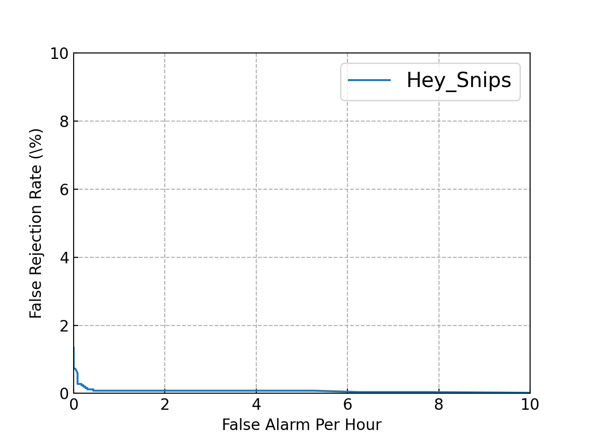

# Wake word detection "Hey Snips" with PyTorch JIT

### [Hey Snips Dataset](https://research.snips.ai/datasets/keyword-spotting)

|          |               |  Train |  Dev   |  Test  | 
|----------|---------------|--------|--------|--------| 
| Positive  | Utterances    | 5,876  | 2,504  | 25,88  | 
|          | Speakers      | 1,179  | 516    | 520    | 
|          | max / speaker | 10     | 10     | 10     | 
| Negative | Utterances    | 45,344 | 20,321 | 20,821 | 
|          | Speakers      | 3,330  | 1,474  | 1,469  | 
|          | max / speaker | 30     | 30     | 30     | 

### Model

Model architecture [MDTC](https://www.sciencedirect.com/science/article/abs/pii/S0893608022000739) with code based on [WeKws](https://github.com/wenet-e2e/wekws)

### Result on test set



### Real time wake word detection

```bash
# !pip install torch torchaudio pyaudio
python wws.py
```